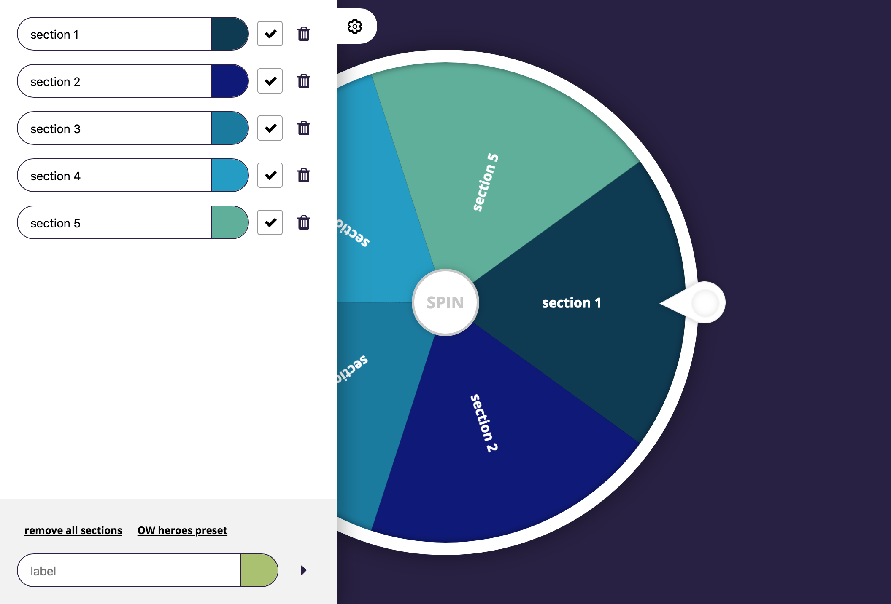

# Lutti Wheel

## I am a noob and I want to run the project on my computer
The following instructions are for non-developpers people who wants to run the project on their machines :

* STEP 1 : Download the zip archive of the project by clicking on [this link](https://github.com/LoicGoyet/lutti-wheel/archive/master.zip)
* STEP 2 : Unzip the archive once the download is over
* STEP 3 : Open with your browser the file located at `lutti-wheel-master/dist/index.html`

If the wheel does not appear into your browser, contact me.

## I am a pro and I want to run the project on my computer
The following instructions are for developpers who wants to run the project with builtin local server and live assets transformation :

* STEP 1 : `git clone https://github.com/LoicGoyet/lutti-wheel`
* STEP 2 : `yarn install`
* STEP 3 : `yarn start`

A local server will run with live reload at [http://localhost:1234](http://localhost:1234)
